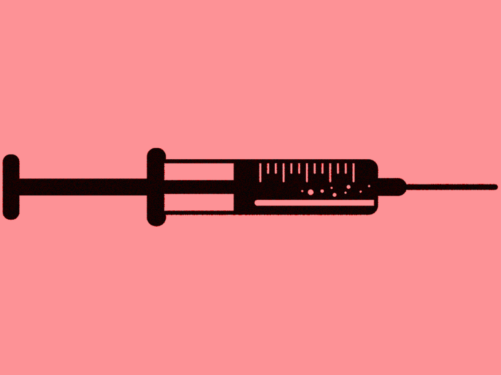
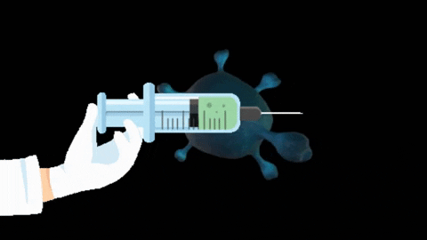
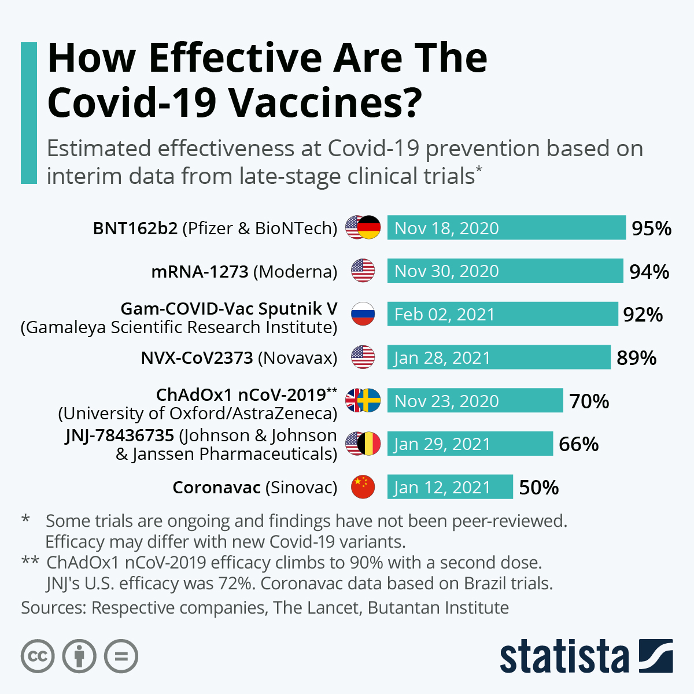
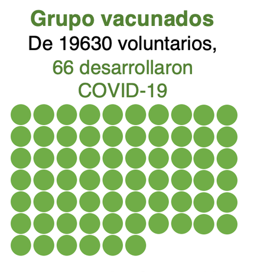
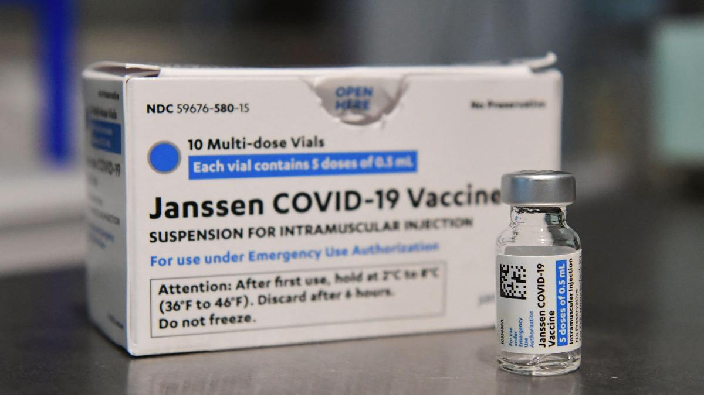
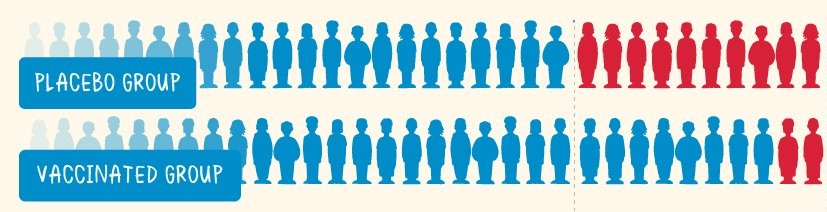
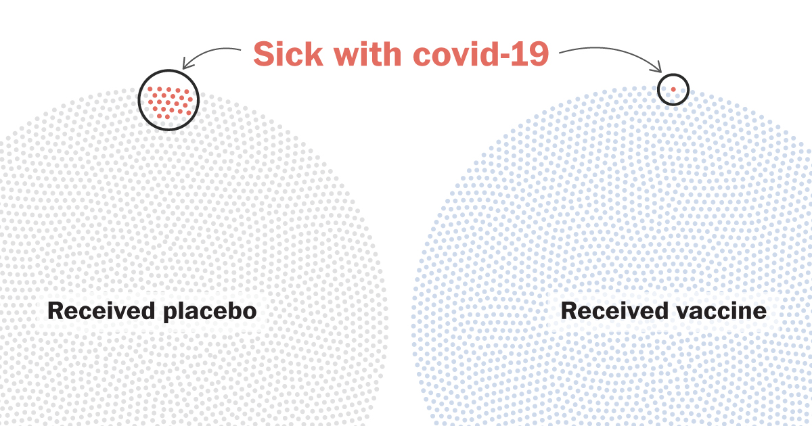
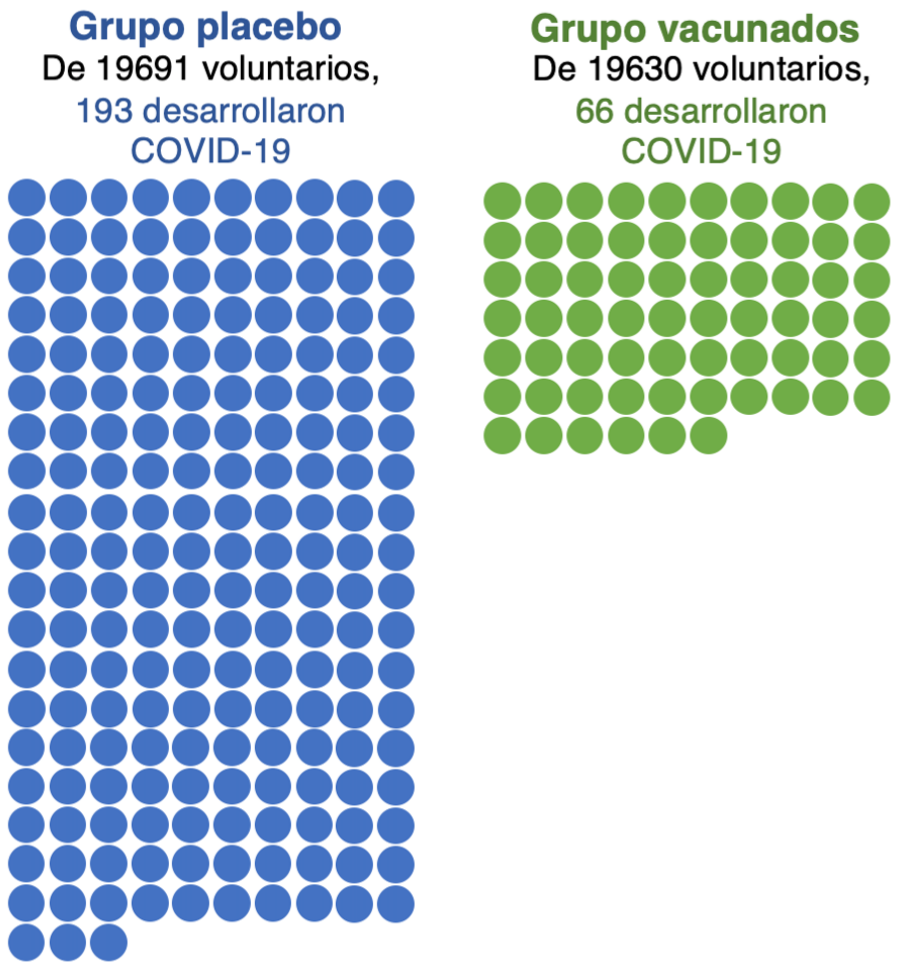

```{r xaringan-themer, include=FALSE, warning=FALSE}
library(xaringanthemer)
library(knitr)
style_mono_accent(
  base_color = "#1037A0",
  inverse_background_color = "#16a67a",
  header_font_google = google_font("Josefin Sans"),
  text_font_google   = google_font("Montserrat", "300", "300i"),
  code_font_google   = google_font("Fira Mono"),
  base_font_size = "20px",
  text_font_size = "1.2rem",
)

opts_chunk$set(
  echo=FALSE,
  message=FALSE,
  warning=FALSE,
  fig.align = 'center'
  )
```

```{r xaringanExtra-share-again, echo=FALSE}
xaringanExtra::use_share_again()
```

```{r setup, include=FALSE}
options(htmltools.dir.version = FALSE,
        fig.align='center', scipen=999)
# library("showtext")
library(ggplot2)
library(ggthemes)
```

class: center, middle
.left[### Antes de arrancar]

## ¿Cómo te sentís con el regreso a las clases presenciales?

```{r, fig.align='center'}

```

Ingresá el código **8069 9287** en el siguiente enlace

[www.menti.com](https://www.menti.com/)

<br/>
[> ver resultados <](https://www.mentimeter.com/s/064a59c4742344d245d5f41fb08c37f9/4f30d7c20fa8)


---
# 🦠 COVID-19

.pull-left[

```{r, fig.align='center'}

```
]
.pull-right[
## ¿Cómo se desarrollan las vacunas?

## ¿Interviene la estadística de alguna manera?
]


---
class: center, middle

<iframe width="853" height="505" src="https://www.youtube.com/embed/74WQgNa3OsQ" title="YouTube video player" frameborder="0" allow="accelerometer; autoplay; clipboard-write; encrypted-media; gyroscope; picture-in-picture" allowfullscreen></iframe>

---
class: center, middle
.pull-left[
# ¿Qué nos dicen las medidas de efectividad de las vacunas? 

```{r, fig.align='center'}

```
]
.pull-right[
```{r eficacia, echo = FALSE}

```
]

---


```{r}
nv <- 19630
xv <- 66
pv <- xv/nv
yv <- nv - xv
LICp <- pv - 1.96*sqrt(pv*(1-pv)/nv)
LSCp <- pv + 1.96*sqrt(pv*(1-pv)/nv)

np <- 19691
xp <- 193
pp <- xp/np
yp <- np - xp
```

# 💉 Ejemplo
.pull-left[

La compañía **Johnson & Johnson**, que entre otras cosas desarrolla productos farmacéuticos, informó -en función de los ensayos para probar la eficacia de su vacuna **Janssen**- que  de las `r nv` personas que la recibieron, `r xv` desarrollaron COVID-19.

```{r, echo = FALSE, out.width='50%'}

```
]
.pull-right[
```{r, echo = FALSE, out.width='65%'}

```

<b><b>
{{content}}

]

--
+ **¿Cuál es el parámetro de interés?** $$\theta = P$$
{{content}}
--
+ **¿Cómo lo podemos estimar?** $$\hat{\theta} = \hat{p}$$
{{content}}

---
## Resolución
### Estimación puntual
$$\hat{p} = \dfrac{`r xv`}{`r nv`} = `r round(pv, 4)` \qquad \Rightarrow \qquad `r round(pv, 4)*100`\mbox{ %}$$
### Estimación por intervalos (95 % de confianza)
$$LIC = `r round(pv, 4)` - 1.96 \, \sqrt{\dfrac{`r round(pv, 4)` \cdot (1-`r round(pv, 4)`)}{`r nv`}} = `r round(LICp, 4)` \qquad \Rightarrow \qquad `r round(LICp, 4)*100`\mbox{ %}$$

$$LSC = `r round(pv, 4)` + 1.96 \, \sqrt{\dfrac{`r round(pv, 4)` \cdot (1-`r round(pv, 4)`)}{`r nv`}} = `r round(LSCp, 4)` \qquad \Rightarrow \qquad `r round(LSCp, 4)*100`\mbox{ %}$$

---
class: inverse, middle, center

.pull-left[
### ¿Esta es la medida de 
### efectividad que se 
### publican en los estudios 
### científicos y medios de 
### comunicación?
# 🤔
]
.pull-right[
```{r, echo = FALSE}

```
]

---
class: center
## ¿Cómo se diseña un experimento para medir la efectividad de vacunas?
```{r, echo = FALSE}

```

<br/>
--
**Grupo Placebo (control)**: voluntarios que reciben una sustancia (*placebo*) sin uso terapéutico que se administra de la misma forma que la vacuna.

--

**Grupo de vacunados**: voluntarios que reciben la vacuna.

---
class: center
## ¿Cómo se diseña un experimento para medir la efectividad de vacunas?
```{r, echo = FALSE, out.width='85%'}

```

---
## 🦠 Riesgo de contraer Covid


.pull-left[

<br/>
```{r}
tablaEmpty <- data.frame(
  covid = c("con Covid", "sin Covid", "Total"),
  Vacunados = c("\\(X_{_V}\\)", "\\(Y_{_V}\\)", "\\(n_{_V}\\)"),
  Placebos = c("\\(X_{_P}\\)", "\\(Y_{_P}\\)", "\\(n_{_P}\\)")
)

kableExtra::kable_styling(
  knitr::kable(tablaEmpty, format = "html", booktabs = TRUE, align = "lcc",
               col.names = c("", "Vacunados", "Placebos")),
  full_width = FALSE, position = "center")
```
]

.pull-right[
### 💉 Riesgo en vacunados
$$\widehat{RV} = \dfrac{X_{_V}}{n_{_V}}$$

.center[### 💊 Riesgo en placebos]
$$\widehat{RP} = \dfrac{X_{_P}}{n_{_P}}$$
]

---
### Riesgo Relativo (RR): 💉 vs. 💊

.pull-left[
$$\widehat{\theta}=\widehat{RR} = \dfrac{\widehat{RV}}{\widehat{RP}} = \dfrac{\dfrac{X_{_V}}{n_{_V}}}{ \dfrac{X_{_P}}{n_{_P}}}$$
]

.pull-right[
**Puede interpretarse como el cociente de la probabilidad de contraer COVID con vacuna y la probabilidad de contraerlo con placebo**
]

<br/>
### Efectividad relativa $(ER)$ de las vacunas 
.pull-left[
$$\widehat{ER} = 1-\widehat{RR}$$
]

.pull-right[
**Indica en cuanto disminuye la probabildad de desarrollar la enfermedad si nos aplicamos la vacuna. (En general, la expresamos en porcentajes.)**
]

---
### Ejemplo (continuación)
.pull-left[
El estudio sobre la vacuna Jansenn detalla la siguiente información en relación a los voluntarios que participaron en sus ensayos clínicos, agrupados como vacunados y placebos:

```{r}
tabla <- data.frame(
  covid = c("con Covid", "sin Covid", "Total"),
  Placebos = c(xp, "", np),
  Vacunados = c(xv, "", nv)
)

kableExtra::kable_styling(
  knitr::kable(tabla, format = "html", booktabs = TRUE, align = "lcc",
               col.names = c("", "Placebos", "Vacunados")),
  full_width = FALSE, position = "center")
```

]
.pull-right[
```{r, echo = FALSE, out.width='90%'}

```
]

---
### Ejemplo (continuación)
.pull-left[
El estudio sobre la vacuna Jansenn detalla la siguiente información en relación a los voluntarios que participaron en sus ensayos clínicos, agrupados como vacunados y placebos:

```{r}
tabla <- data.frame(
  covid = c("con Covid", "sin Covid", "Total"),
  Placebos = c(xp, yp, np),
  Vacunados = c(xv, yv, nv)
)

kableExtra::kable_styling(
  knitr::kable(tabla, format = "html", booktabs = TRUE, align = "lcc",
               col.names = c("", "Placebos", "Vacunados")),
  full_width = FALSE, position = "center")
```

]
.pull-right[
```{r, echo = FALSE, out.width='90%'}

```
]

---
## Resolución
```{r}
RV <- pv
RP <- pp

RR <- RV/RP
```

### Riesgo relativo de la vacuna Janssen
$$\widehat{RR} = \dfrac{`r xv` / `r nv`}{`r xp` / `r np`} = \dfrac{`r round(RV, 4)`}{`r round(RP, 4)`} = `r round(RR, 4)` \qquad \Rightarrow \qquad `r round(RR, 4)*100` \mbox{ %}$$
<br/>
### Efectividad relativa de la vacuna Janssen

$$\widehat{ER} = 1 - `r round(RR, 4)` = `r (1 - round(RR, 4))` \qquad \Rightarrow \qquad `r (1 - round(RR, 4))*100` \mbox{ %}$$

---
class: inverse, middle, center

## ¿Cómo podemos obtener un 
## intervalo de confianza para
## el Riesgo Relativo?
# 🤔

---
### 📉 Distribución del estimador del RR
Cuando $n$ es suficientemente grande, el estimador del RR tiene una distribución aproximadamente normal
$$\widehat{RR} \stackrel{a}{\sim}  N(RR, Var(\widehat{RR}))$$
--

###  Intervalo de confianza

--

$$\widehat{\theta} \; \pm \; z \, EE(\widehat{\theta})$$

--

$$\widehat{RR} \; \pm \; z \, EE(\widehat{RR})$$

Donde $EE(\widehat{RR}) = \sqrt{Var(\widehat{RR})}$

---

## ¿Cómo calculamos $Var(\widehat{RR})$?

--
**Buscaremos el estimador de una transformación del RR, $\theta^{*} = \ln(RR)$:**
--
$$\widehat{\theta}^{*} =\widehat{\ln\left(RR\right)} = \widehat{\ln\left(\dfrac{R_{_V}}{R_{_P}}\right)} =  \widehat{\ln\left(R_{_V}\right)} - \widehat{\ln\left(R_{_P}\right)}$$
<br/>

### Intervalo de confianza
$$\widehat{\theta}^{*} \; \pm \; z \, EE(\widehat{\theta}^{*})$$
---

### Varianza de $\widehat{\theta}^{*}$
$$Var(\widehat{\theta}^{*}) = Var\left(\widehat{\ln\left(RR\right)}\right) = Var\left(\widehat{\ln\left(R_{_V}\right)} - \widehat{\ln\left(R_{_P}\right)}\right)$$
--
Aplicando propiedades de la varianza resulta
$$Var(\widehat{\theta}^{*}) = Var\left(\widehat{\ln\left(R_{_V}\right)}\right) + Var\left(\widehat{\ln\left(R_{_P}\right)}\right)$$
<br/>
--

**Estimadores para la varianza de $\ln\left(R_{_V}\right)$ y $\ln\left(R_{_P}\right)$**

.pull-left[

$$Var\left(\widehat{\ln\left(R_{_V}\right)}\right) = \dfrac{Y_{_V}/X_{_V}}{n_{_V}}$$
]

.pull-right[

$$Var\left(\widehat{\ln\left(R_{_P}\right)}\right) = \dfrac{Y_{_P}/X_{_P}}{n_{_P}}$$
]

---
### Ejemplo (continuación)
.pull-left[
El estudio sobre la vacuna Jansenn detalla la siguiente información en relación a los voluntarios que participaron en sus ensayos clínicos, agrupados como vacunados y placebos:

```{r}
tabla <- data.frame(
  covid = c("con Covid", "sin Covid", "Total"),
  Placebos = c(xp, yp, np),
  Vacunados = c(xv, yv, nv)
)

kableExtra::kable_styling(
  knitr::kable(tabla, format = "html", booktabs = TRUE, align = "lcc",
               col.names = c("", "Placebos", "Vacunados")),
  full_width = FALSE, position = "center")
```

]
.pull-right[
```{r, echo = FALSE, out.width='90%'}

```
]

---

## Resolución
```{r}
Var_Rv <- (yv/xv) / nv
Var_Rp <- (yp/xp) / np

LIC_RR <- log(RR) - 1.96*sqrt(Var_Rv+Var_Rp)
LSC_RR <- log(RR) + 1.96*sqrt(Var_Rv+Var_Rp)
```

### Estimación de la varianza de $\widehat{\ln(RR)}$

.pull-left[

$$Var\left(\widehat{\ln\left(R_{_V}\right)}\right) = \dfrac{`r yv`/`r xv`}{`r nv`} = `r round(Var_Rv, 4)`$$
]

.pull-right[

$$Var\left(\widehat{\ln\left(R_{_P}\right)}\right) = \dfrac{`r yp`/`r xp`}{`r np`} = `r round(Var_Rp, 4)`$$
]

--

<br/>
$$Var\left(\widehat{\ln\left(RR\right)}\right) = `r round(Var_Rv, 4)` + `r round(Var_Rp, 4)` = `r round(Var_Rv + Var_Rp, 4)`$$

---

## Resolución

### Intervalo de confianza para $\ln(RR)$

$$\widehat{\theta}^{*} \; \pm \; z \, EE(\widehat{\theta}^{*})$$
<br/>

$$LIC(\theta^{*}) = \ln(`r round(RR, 4)`) - 1.96 \, \sqrt{`r round(Var_Rv + Var_Rp, 4)`} = `r round(LIC_RR, 4)`$$

$$LSC(\theta^{*}) = \ln(`r round(RR, 4)`) + 1.96 \, \sqrt{`r round(Var_Rv + Var_Rp, 4)`}=`r round(LSC_RR, 4)`$$


---

## Resolución

### Intervalo de confianza para el $RR$ de la vacuna Jansenn

$$LIC(\theta^{*})= LIC(\ln(\theta)) = `r round(LIC_RR, 4)` \qquad \Rightarrow \qquad LIC(\theta) = e^{`r round(LIC_RR, 4)`} = `r round(exp(LIC_RR), 4)`$$

$$LSC(\theta^{*})= LSC(\ln(\theta)) = `r round(LSC_RR, 4)` \qquad \Rightarrow \qquad LSC(\theta) = e^{`r round(LSC_RR, 4)`} = `r round(exp(LSC_RR), 4)`$$
--
<br/>
### Intervalo de confianza para la efectividad de la vacuna Jansenn

$$LIC(ER)= 1- LSC(\theta)= 1 - `r round(exp(LSC_RR), 4)` = `r round(1-exp(LSC_RR), 4)`  \qquad \Rightarrow \qquad `r round(1-exp(LSC_RR), 4)*100` \mbox{ %}$$

$$LSC(ER)= 1- LIC(\theta)= 1 - `r round(exp(LIC_RR), 4)` = `r round(1-exp(LIC_RR), 4)` \qquad \Rightarrow \qquad `r round(1-exp(LIC_RR), 4)*100` \mbox{ %}$$
---

# 💉 Resumen de efectividad de Jansenn
.pull-left[
```{r, echo = FALSE, out.width='75%'}

```
]
.pull-right[

### Eficiencia Relativa
$$\widehat{ER} = `r round(1-RR, 4)*100` \mbox{ %}$$
### Intervalo de confianza
$$\left(`r round(1-exp(LSC_RR), 4)*100` \mbox{ %} \, , \, `r round(1-exp(LIC_RR), 4)*100` \mbox{ %} \right)$$
]

---
class: center, middle


```{r, fig.align='center', out.width='75%'}

```

## Hasta la próxima 👋
